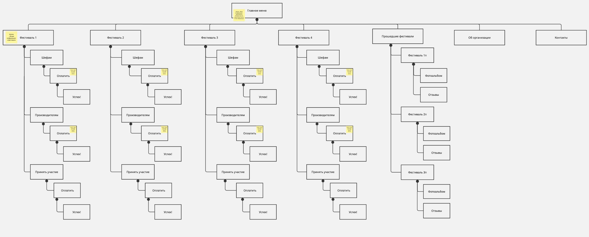
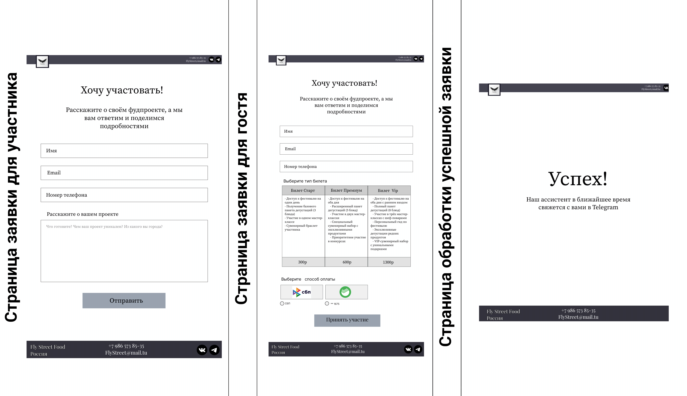

<h1 align="center">Создание дизайна веб-сайта фестивалей уличной еды</h1>

<h2>Описание</h2>
Данный дизайн сайта предполагается для создания будущего веб-сайта для компании, организующей фестивали уличной еды.  В макете предусмотрена удобная навигация, позволяющая просматривать информацию как об актуальных, так и о прошедших фестивалях. Для актуальных мероприятий реализованы блоки для возможность подачи заявки на участие прямо на сайте. Также макет содержит раздел с информацией о самой компании.

<h2>Анализ целевой аудитории</h2>
Целевая аудитория сайта — люди, заинтересованные в уличной еде и мероприятиях, связанных с гастрономией и культурой. 
Основные группы: молодёжь и взрослые люди (18–35 лет), семьи и компании друзей, туристы, профессионалы и участники рынка уличной еды, владельцы фудтраков, повара и организаторы

<h2>Анализ конкурентов</h2>
Конкуренты реализуют  разные стратегии продвижения. Большинство существующих площадок ориентированы на широкое освещение фестивалей всех тематик, в то время как в России был обнаружен лишь один ресурс, специализирующийся исключительно на фестивалях уличной еды. Это свидетельствует о высокой уникальности формата данного проекта и наличии свободной рыночной ниши.
В основном конкуренты используют мощь своих брендов и ресурсов для создания доверия и привлечения широкой аудитории. Например такие конкуренты "Халва" и "Ингосстрах", используют тему фестивалей как часть своей контент-стратегии, предлагая пользователям не просто информацию, а дополнительную ценность — будь то финансовые выгоды, ощущение надежности или удобство в виде структурированных гидов и путеводителей. При этом узкоспециализированный конкурент, такой как Streetfoodrussia, выигрывает за счет продвижения в конкретной нише фестивалей уличной еды, становясь самым полным и авторитетным источником для целевой аудитории. За счет этого он становится главным конкурентом, так как макет сайта имеет такую же узкую специализацию

<h2>Карта сайта</h2>

Карта сайта фестивалей уличной еды представляет собой иерархическую структуру, начинающуюся с главной страницы. Основные разделы включают информацию о различных фестивалях, прошедших фестивалях, раздел для организаторов и контактную информацию. Каждый фестиваль содержит информацию для шефов и производителей, а также возможность принять участие. Прошедшие фестивали предлагают фотоотчеты и отзывы. Сайт предполагает возможность онлайн-оплаты.

<h2>Ссылка на макет в Figma </h2>
<a href="https://www.figma.com/design/R0YI7VVeclQTquqY6f75H1/Untitled?node-id=0-1&amp;p=f&amp;t=wGptOSa2A8P0VX5B-0">Открыть в Figma</a>
<h2>Скриншоты </h2>

<h4 align="center">
  
   
  На данном скриншоте изображены главные страницы, которые содержат информацию об актуальных фестивалях
</h4>

<h4 align="center">
  
   
  На данном скриншоте изображены страницы для оформления заявки для участия
</h4>

<h4 align="center">
  
   
  На данном скриншоте изображены страницы с информацией о прошедших фестивалях
</h4>

